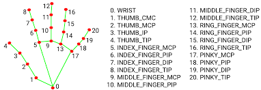

# Hand Skeleton Realtime (MediaPipe / WiLoR-mini)

Realtime hand skeleton tracking using **MediaPipe** or **WiLoR-mini**, with optional video recording and visualization.

The system captures webcam input, detects hand keypoints (21 joints), and draws a skeleton overlay in real time.  
It also supports saving the output video for dataset recording or visualization.

---

# Features

- Realtime hand skeleton tracking
- Supports **two backends**
  - MediaPipe
  - WiLoR-mini
- Draws **21-keypoint hand skeleton**
- Middle three fingers highlighted in **red**
- Bounding box + hand label (**Left / Right**)
- FPS display
- Temporal smoothing with `--filter`
  - `none`
  - `ema`
  - `oneeuro`
  - `kalman`
- Save output video
- Webcam input support

---

# Skeleton Visualization

The skeleton follows the **MediaPipe 21-keypoint topology**.

Finger coloring:

| Finger | Color |
|------|------|
| Thumb | Green |
| Index | Red |
| Middle | Red |
| Ring | Red |
| Pinky | Green |
| Palm | Green |

Joints are displayed as **red points**.

---

# Installation

Run installation commands from the repository root.

For the MediaPipe backend:

```bash
python -m pip install -r requirements.txt
```

For the optional WiLoR-mini backend:

```bash
python -m pip install --upgrade setuptools wheel
python -m pip install --no-build-isolation -r requirements-wilor.txt
```

> [!IMPORTANT]
> WiLoR-mini depends on Chumpy, whose legacy build script requires `--no-build-isolation`. MediaPipe does not require Chumpy or the WiLoR dependency file.

> [!TIP]
> For CUDA acceleration, install the appropriate PyTorch build before `requirements-wilor.txt`.

---

# Usage: Backend Selection

### MediaPipe

```bash
python3 -m Gripper_Skeleton.realtime_hand_skeleton --backend mediapipe
```

### WiLoR-mini

```bash
python3 -m Gripper_Skeleton.realtime_hand_skeleton --backend wilor-mini
```

---

# Temporal Filter

You can enable temporal smoothing with `--filter`.

Available options:

- `none`: no smoothing
- `ema`: exponential moving average
- `oneeuro`: One Euro filter
- `kalman`: constant-velocity Kalman filter

Examples:

```bash
python3 -m Gripper_Skeleton.realtime_hand_skeleton --backend mediapipe --filter none
python3 -m Gripper_Skeleton.realtime_hand_skeleton --backend mediapipe --filter ema
python3 -m Gripper_Skeleton.realtime_hand_skeleton --backend mediapipe --filter oneeuro
python3 -m Gripper_Skeleton.realtime_hand_skeleton --backend mediapipe --filter kalman
```

For offline testing with video input:

```bash
python3 -m Gripper_Skeleton.realtime_hand_skeleton --backend mediapipe --testmode input.mp4 --filter kalman
```

---

# Example Output

### Prediction Format

Each detection returns:

```python
[keypoint_array, label]
```

Example output:

```python
[(array([[444, 290],
        [412, 296],
        [387, 320],
        [376, 347],
        [373, 371],
        [386, 317],
        [361, 351],
        [360, 377],
        [363, 394],
        [408, 321],
        [392, 362],
        [390, 389],
        [390, 403],
        [432, 326],
        [421, 365],
        [418, 388],
        [415, 400],
        [454, 331],
        [446, 363],
        [440, 382],
        [435, 394]]), 'Right')]
```

Explanation:

- `keypoint_array` → shape `(21,2)`
- Each row represents pixel coordinates `(x, y)`
- `label` → `"Left"` or `"Right"`

---

# Keypoint Definition

```
0  Wrist

Thumb
1  Thumb_CMC
2  Thumb_MCP
3  Thumb_IP
4  Thumb_Tip

Index
5  Index_MCP
6  Index_PIP
7  Index_DIP
8  Index_Tip

Middle
9  Middle_MCP
10 Middle_PIP
11 Middle_DIP
12 Middle_Tip

Ring
13 Ring_MCP
14 Ring_PIP
15 Ring_DIP
16 Ring_Tip

Pinky
17 Pinky_MCP
18 Pinky_PIP
19 Pinky_DIP
20 Pinky_Tip
```

---

# Camera Options

### Select camera device

```bash
python3 -m Gripper_Skeleton.realtime_hand_skeleton --camera_id 1
```

### Change resolution  
(default: `640x360`)

```bash
python3 -m Gripper_Skeleton.realtime_hand_skeleton --width 1280 --height 720
```

### Mirror camera image

```bash
python3 -m Gripper_Skeleton.realtime_hand_skeleton --flip
```

### Show FPS

```bash
python3 -m Gripper_Skeleton.realtime_hand_skeleton --show_fps
```

---

# Output Video

The program automatically saves the skeleton overlay video:

```
hand_skeleton_output.mp4
```

Video settings:

- FPS: **20**
- Resolution: same as camera input

Useful for:

- gesture dataset recording
- debugging
- demo visualization

---

# Project Structure

```
project/
│
├── realtime_hand_skeleton.py
├── README.md
├── requirements.txt
└── hand_skeleton_output.mp4
```

---

# Backend Comparison

| Backend | FPS | Accuracy | Notes |
|------|------|------|------|
| MediaPipe | 30–60 FPS | Good | Lightweight |
| WiLoR-mini | 20–30 FPS | Higher | Deep learning model |

---

# Keyboard Controls

| Key | Action |
|----|----|
| ESC | Exit |
| q | Exit |

---

# Pipeline

```
Camera
   ↓
Hand Detection
   ↓
Keypoint Prediction (21 joints)
   ↓
Skeleton Rendering
   ↓
Display + Save Video
```

---

# Possible Applications

- Gesture recognition
- Human–computer interaction
- XR / VR interaction
- Robot teleoperation
- Hand pose dataset recording
