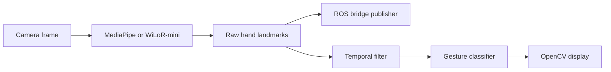

<div align="center">

# Real-Time Hand Gesture Recognition

Hand landmark tracking, gesture classification, temporal smoothing, and ROS bridge publishing with MediaPipe or WiLoR-mini.

[Overview](#overview) &middot; [Quick start](#quick-start) &middot; [Configuration](#configuration) &middot; [ROS bridge](#ros-bridge-output) &middot; [Training](#gesture-models-and-training) &middot; [Troubleshooting](#troubleshooting)


</div>

## Overview

This project captures webcam frames, detects the 21 landmarks of a hand, and renders the result in real time with OpenCV. It supports a lightweight MediaPipe backend, an optional WiLoR-mini backend, smoothing filters, TensorFlow Lite gesture classifiers, and JSON landmark publishing through rosbridge.

> [!NOTE]
> The default `app.py` workflow performs hand tracking only. Add `--gesture_classifier_enable` to load the included hand-sign and point-history classifiers.

## Features

- MediaPipe and WiLoR-mini hand-tracking backends
- 21-point skeleton rendering with handedness and FPS display
- `none`, EMA, One Euro, and Kalman temporal filters
- Optional Paper/Stone/Scissor and motion gesture classification
- ROS bridge publishing through a configurable host, port, and topic
- Keyboard-driven training-data collection and Jupyter training notebooks
- Standalone webcam/video skeleton recording and jitter evaluation
- MediaPipe CPU and Tasks API GPU modes

## How it works



ROS publishing uses the raw tracker output. Smoothing is applied to the landmarks used by the display and gesture pipeline.

## Prerequisites

- Python 3.10 or 3.11
- A webcam or video capture device
- Git, required to install WiLoR-mini from its repository
- A running rosbridge WebSocket server when ROS publishing is enabled

> [!IMPORTANT]
> Run commands from the repository root. Model and dataset paths in the application are relative to that directory.

> [!NOTE]
> `requirements.txt` contains the MediaPipe, ROS, and training dependencies. The heavier WiLoR-mini stack is isolated in `requirements-wilor.txt`. MediaPipe is pinned to `0.10.9`.

## Quick start

1. Clone the repository and enter the project directory:

   ```bash
   git clone https://github.com/ocar1053/hand-gesture-recognition-mediapipe.git
   cd hand-gesture-recognition-mediapipe
   ```

2. Create and activate a virtual environment:

   ```bash
   python3 -m venv venv
   source venv/bin/activate
   ```

   On Windows PowerShell, use `venv\Scripts\Activate.ps1`.

3. Install the core dependencies:

   ```bash
   python -m pip install --upgrade pip
   python -m pip install -r requirements.txt
   ```

   This is enough for the MediaPipe and rosbridge command below. It does not install WiLoR-mini, Chumpy, PyTorch, or Ultralytics.

4. Run the application with MediaPipe and rosbridge:

   ```bash
   python3 app.py --device 0 --rosbridge_enable --backend mediapipe --rosbridge_host localhost
   ```

   This opens camera `0`, connects to `ws://localhost:9090`, and publishes hand data to `/mediapipe/hands`. Press `Esc` to exit.

   > [!NOTE]
   > If rosbridge is unavailable, the application reports the connection error and continues with local hand tracking.

### Common commands

Run MediaPipe without ROS:

```bash
python3 app.py --device 0 --backend mediapipe
```

Enable smoothing and the included gesture classifiers:

```bash
python3 app.py --device 0 --backend mediapipe --filter oneeuro --gesture_classifier_enable
```

Use WiLoR-mini with Kalman filtering:

```bash
python3 app.py --device 0 --backend wilor-mini --filter kalman
```

Install its optional dependencies first:

```bash
python -m pip install --upgrade setuptools wheel
python -m pip install --no-build-isolation -r requirements-wilor.txt
```

> [!IMPORTANT]
> `--no-build-isolation` is required because Chumpy uses a legacy build script that imports pip during installation. MediaPipe users do not need Chumpy or this workaround.

> [!TIP]
> For WiLoR-mini with CUDA, install a PyTorch build compatible with your CUDA environment before installing `requirements-wilor.txt`.

Request the MediaPipe Tasks API GPU delegate:

```bash
python3 app.py --device 0 --backend mediapipe --mediapipe_delegate gpu
```

The application automatically looks for `hand_landmarker.task` in the repository root. Use `--mediapipe_task_model /path/to/hand_landmarker.task` if the model is stored elsewhere.

> [!WARNING]
> MediaPipe GPU support depends on the platform and installed runtime. If GPU initialization fails, the application prints the reason and falls back to the MediaPipe Solutions CPU tracker.

## Configuration

Run `python3 app.py --help` to list all options.

| Option | Default | Description |
| --- | --- | --- |
| `--device` | `2` | OpenCV camera device index. Use `0` for the first camera on most systems. |
| `--width` | `960` | Requested capture width in pixels. |
| `--height` | `540` | Requested capture height in pixels. |
| `--use_static_image_mode` | Disabled | Detect each frame independently instead of tracking between frames. |
| `--min_detection_confidence` | `0.7` | Minimum hand-detection confidence. |
| `--min_tracking_confidence` | `0.5` | Minimum landmark-tracking confidence. |
| `--backend` | `mediapipe` | Tracking backend: `mediapipe` or `wilor-mini`. |
| `--filter` | `none` | Temporal filter: `none`, `ema`, `oneeuro`, or `kalman`. |
| `--gesture_classifier_enable` | Disabled | Enable the included TensorFlow Lite gesture classifiers. |
| `--rosbridge_enable` | Disabled | Publish landmark data through rosbridge. |
| `--rosbridge_host` | `localhost` | rosbridge server hostname or IP address. |
| `--rosbridge_port` | `9090` | rosbridge WebSocket port. |
| `--rosbridge_topic` | `/mediapipe/hands` | ROS topic used for hand data. |
| `--mediapipe_delegate` | `cpu` | MediaPipe delegate: `cpu` or `gpu`. |
| `--mediapipe_task_model` | Auto-detected | Path to a MediaPipe `hand_landmarker.task` model. |

## ROS bridge output

When `--rosbridge_enable` is set, the application publishes `std_msgs/String` messages containing JSON. The topic defaults to `/mediapipe/hands`.

```json
{
  "detected": true,
  "multi_hand_landmarks": [
    {
      "label": "Right",
      "landmark": [
        { "x": 0.42, "y": 0.31, "z": -0.01 }
      ]
    }
  ]
}
```

Each detected hand contains 21 landmarks. The `x` and `y` coordinates are normalized to the camera frame; `z` is the backend-provided depth when available and `0.0` otherwise. When no hand is detected, `detected` is `false` and `multi_hand_landmarks` is empty.

To publish on a different server or topic:

```bash
python3 app.py \
  --device 0 \
  --backend mediapipe \
  --rosbridge_enable \
  --rosbridge_host 192.168.1.20 \
  --rosbridge_port 9090 \
  --rosbridge_topic /hand_tracking/landmarks
```

## Keyboard controls

| Key | Action |
| --- | --- |
| `Esc` | Exit the main application. |
| `n` | Return to normal inference mode. |
| `k` | Enter keypoint logging mode. |
| `h` | Enter point-history logging mode. |
| `0`-`9` | Append a sample with that class ID while a logging mode is active. |

> [!WARNING]
> Logging writes directly to the CSV datasets. Commit or back up the existing data before collecting a new dataset.

## Gesture models and training

Enable the bundled classifiers with:

```bash
python3 app.py --device 0 --gesture_classifier_enable
```

| Classifier | Included labels | Dataset | Training notebook |
| --- | --- | --- | --- |
| Hand sign | Paper, Stone, Scissor | `model/keypoint_classifier/keypoint.csv` | `keypoint_classification.ipynb` |
| Point history | Stop, Clockwise, Counter Clockwise, Move | `model/point_history_classifier/point_history.csv` | `point_history_classification.ipynb` |

Use `k` or `h` to select the dataset, press a digit to record that class ID, then run the corresponding notebook to retrain and export the model. Keep each label CSV in the same class-ID order as its training data.

> [!IMPORTANT]
> The runtime loads the hand-sign model from `model/keyp/keypoint_classifier.tflite`. After retraining with `keypoint_classification.ipynb`, place the exported TFLite model at that path. The point-history runtime model remains at `model/point_history_classifier/point_history_classifier.tflite`.

## Standalone skeleton recorder

`Gripper_Skeleton/realtime_hand_skeleton.py` provides video recording, offline video processing, FPS display, and jitter evaluation independently of the gesture classifiers.

Run it as a module from the repository root:

```bash
python3 -m Gripper_Skeleton.realtime_hand_skeleton \
  --backend mediapipe \
  --camera_id 0 \
  --filter ema \
  --flip \
  --show_fps
```

Process a video and report jitter statistics:

```bash
python3 -m Gripper_Skeleton.realtime_hand_skeleton \
  --backend mediapipe \
  --testmode input.mp4 \
  --filter kalman \
  --eval_jitter
```

Webcam runs write `hand_skeleton_output.mp4`. Video runs write a new file beside the input using the selected filter and backend in the filename.

## Project structure

```text
.
|-- app.py                              # Main tracking, gestures, and ROS application
|-- requirements.txt                   # Core MediaPipe, ROS, and training dependencies
|-- requirements-wilor.txt             # Optional WiLoR-mini dependency stack
|-- hand_landmarker.task               # MediaPipe Tasks model used by GPU mode
|-- Gripper_Skeleton/
|   |-- realtime_hand_skeleton.py      # Standalone recorder and jitter evaluator
|   `-- filter.py                      # EMA, One Euro, and Kalman filters
|-- model/
|   |-- keyp/                          # Runtime hand-sign TFLite model
|   |-- keypoint_classifier/           # Hand-sign data, labels, models, and module
|   `-- point_history_classifier/      # Motion data, labels, models, and module
|-- utils/
|   |-- cvfpscalc.py                   # FPS calculation
|   `-- rosbridge_publisher.py         # std_msgs/String JSON publisher
|-- keypoint_classification.ipynb      # Hand-sign model training
`-- point_history_classification.ipynb # Point-history model training
```

## Troubleshooting

- **Camera does not open:** try another `--device` value and verify camera permissions with another OpenCV application.
- **No ROS messages:** confirm rosbridge is listening on the configured WebSocket host and port, and that subscribers use `std_msgs/String`.
- **MediaPipe GPU falls back to CPU:** verify `hand_landmarker.task` exists and that the installed MediaPipe runtime supports a GPU delegate on the current platform.
- **WiLoR-mini is not installed:** install build tools, then run `python -m pip install --no-build-isolation -r requirements-wilor.txt`.
- **Models or CSV files are not found:** start the command from the repository root so relative paths resolve correctly.
